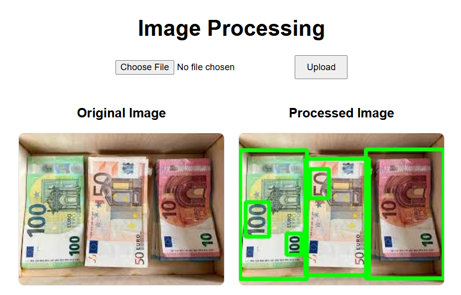

# AI-Powered Banknote Detection

## Overview
Web-based solution that allows users to upload images for analysis using an AI model running on a virtual server. The model detects and identifies banknotes.



## Technologies & Libraries Used
- **Backend:** Django, Django REST Framework
- **AI Model:** YOLO
- **Image Processing:** OpenCV
- **Frontend:** React, JavaScript, Axios
- **Server & Storage:** Django Media Storage, Local Development Server

## System Workflow
1. User uploads an image via the web interface.
2. The image is sent to the Django API for processing.
3. The AI model detects banknotes and marks them on the image.
4. The processed image and a summary of detected banknotes are returned to the frontend.
5. The results are displayed side by side with the original image.

## How to Run the System
### **Backend Setup**
1. Clone the repository:
   ```bash
   git clone https://github.com/yourusername/your-repo.git
   cd your-repo
   ```
2. Create a virtual environment and install dependencies:
   ```bash
   python -m venv venv
   source venv/bin/activate  # On Windows: venv\Scripts\activate
   pip install -r requirements.txt
   ```
3. Apply migrations and run the server:
   ```bash
   python manage.py migrate
   python manage.py runserver
   ```
4. Ensure media files are correctly served by updating `settings.py`:
   ```python
   MEDIA_URL = '/media/'
   MEDIA_ROOT = os.path.join(BASE_DIR, 'media')
   ```

### **Frontend Setup**
1. Navigate to the frontend directory:
   ```bash
   cd frontend
   ```
2. Install dependencies:
   ```bash
   npm install
   ```
3. Start the React app:
   ```bash
   npm start
   ```
4. Open `http://localhost:3000` in your browser.

## Results & Visualization
- The system correctly identifies and highlights banknotes.
- The processed image is displayed alongside the original.

## What could be improved
- Implement a more advanced AI model and train it with a larger dataset. For better precision, work with different parameters and train with more epochs.
